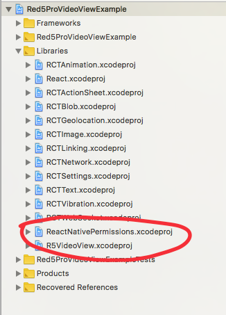
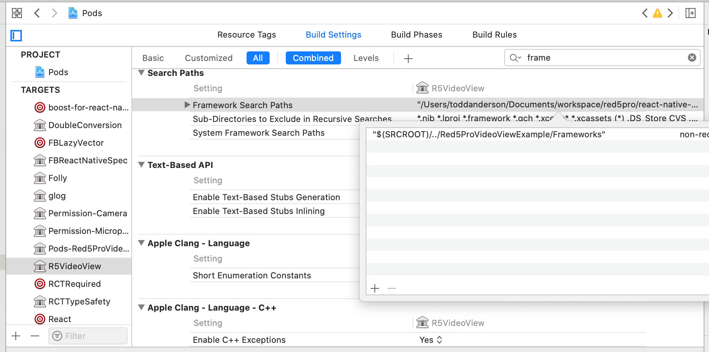
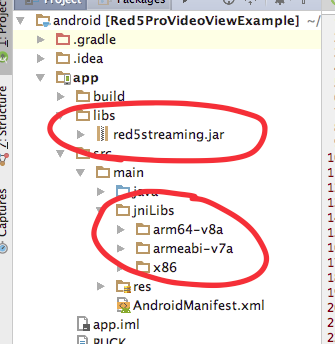

<h3 align="center">
  <a href="https://account.red5pro.com/register" target="_blank"></a>
</h3>

---

# react-native-red5pro

React Native Red5 Pro Publisher & Subscriber.

* [Install](#install)
  * [iOS](#ios)
  * [Android](#android)
* [Project Setup](#project-setup)
  * [iOS](#ios-project-setup)
  * [Android](#android-project-setup)
* [Usage](#usage)
  * [Properties](#properties)
  * [Methods](#methods)
  * [Event Callbacks](#callbacks)
* [Red5 Pro Quickstart](#red5-pro)

> You will need a Red5 Pro SDK License and a Red5 Pro Server in order to use this component. [Sign up for a free trial!](https://account.red5pro.com/register)

# Install

Install the `react-native-red5pro` component:

```sh
$ npm i --save react-native-red5pro
```

If you intend to use the live broadcasting capabilities of the [Red5 Pro SDK](https://www.red5pro.com/docs/streaming/), install the `react-native-permissions` module that will present to the user the permissions dialogs for Camera and Microphone:

```sh
$ npm i --save react-native-permissions
```

> More information about [react-native-permissions](https://github.com/yonahforst/react-native-permissions)

Finally, run the following to link the libraries into your projects:

```sh
$ react-native link
```

## iOS

After running `react-native link`, the `react-native-red5pro` library - and optionally the `react-native-permissions` library - will be added to the *Libraries* of your iOS project:



### Troubleshooting

If the libraries were not adding using `react-native link`, you can drag them in manually. For the `react-native-red5pro` library:

1. Open a file browser and navigate to the *react-native-red5pro* install in *node_modules*.
2. Within the *node_modules/react-native-red5pro* directory, locate the `R5VideoView.xcodeproj` under *ios/R5VideoView*.
3. Drag the `R5VideoView.xcodeproj` file into your Xcode project and under the `Libraries` Group.

The `react-native-red5pro` library should now be installed and available.

_Follow similar instructions for `react-native-permissions`, if needed._

> > Review the [iOS Example](example/ios) included in this repository.

## Android

After running `react-native link`, the `react-native-red5pro` library will be added your Android project:


### Troubleshooting

If the `react-native-red5pro` library was not added using `react-naive link`, you can add them manually for Android by doing the follow in your project:

1. Locate and open the `settings.gradle` for your Android app.
2. Add `:react-native-red5pro` to the `include` and define the library project location:

```txt
rootProject.name = 'Red5ProVideoViewExample'

include ':app',
        ':react-native-red5pro'

project(':react-native-red5pro').projectDir = new File(rootProject.projectDir, '../../android')
```

Now locate the `build.gradle` for your Android app, and add the following to the `dependencies`:

```txt
compile project(':react-native-red5pro')
```

> Review the [Android Example](example/android) included in this repository.

# Project Setup

It is assumed that you have used the [create-react-native](https://github.com/react-community/create-react-native-app) CLI tool to bootstrap your projects. If you have used other means to set up your projects, some instructions may be different.

In addition to adding the `react-native-red5pro` library - and optionally `react-native-permissions` library - as [described above](#installation), there are additional project settings required, including the addition of the [Red5 Pro Mobile SDK](https://www.red5pro.com/docs/streaming/).

This section will describe how to setup your projects to integrate the [Red5 Pro Mobile SDK](https://www.red5pro.com/docs/streaming/) so you can use the `react-native-red5pro` library to display a video view for broadcasting and subscribing to a live stream.

> You will need a Red5 Pro SDK License and a Red5 Pro Server in order to use this component. [Sign up for a free trial!](https://account.red5pro.com/register)

## iOS Project Setup

After linking in the `react-native-red5pro` library as described in the [previous section](#installation), you will need to install the *Red5 Pro iOS SDK* and update the permissions for you project.

### Install Red5 Pro SDK

To integrate the *Red5 Pro iOS SDK*:

1. Download the latest [Red5 Pro iOS SDK](https://account.red5pro.com/download) from your account. If you don't have an account yet, [Sing up for a free trial!](https://account.red5pro.com/register).
2. Unpack the *Red5 Pro iOS SDK* into a location on your local machine - there will be a `R5Streaming.framework` file. This is the *Red5 Pro iOS SDK*.
3. Within your Xcode project panel, determine if you already have a `Frameworks` Group available for your project. If not, follow to step #4; if you have one, follow to step #5.
4. Right-Click on the top-level project, select `New Group` and when it is generated for the project, click on `New Group` to make it editable and name if `Frameworks`.
5. Drag the `R5Streaming.framework` file from a file browser into the Xcode project and under the `Frameworks` Group.
6. In the following dialog, select to `Copy items...` and ensure that your project is selected to add it to.
7. Click `Finish`.

The `R5Streaming.framework` should now be located within the `Frameworks` Group of your project. Select it and make note of its location (*Full Path*) in the Identities Panel of your Xcode project.

The `react-native-red5pro` library is not shipped with the *Red5 Pro SDK*. As such, we need to point the `react-native-red5pro` library point to the `R5Streaming.framework` dependency:

1. Locate the `R5VideoView.xcodeproj` under the `Libraries` Group of the Project Panel of Xcode.
2. Select the **Target** `R5VideoView`, and click `Build Settings`.
3. Search for "**frameworks**" (sans quotes), and navigate to the `Framework Search Paths`.
4. Click on the Value field and add the path to the `R5Streaming.framework` file (either relative or full path).



### Required Dependencies

The *Red5 Pro iOS SDK* requires a few additional dependencies in order to properly broadcast and consume live streams. Add the following libraries and frameworks to your project under the *General > Linked Frameworks and Libraries* panel:

```
libstdc++.6.0.9.tbd
libiconv.2.4.0.tbd
libbz2.1.0.tbd
libz.tbd

GLKit
QuartzCore
OpenAL
CoreFoundation
VideoToolbox
```

### Define Permissions

If you intend to use the `react-native-red5pro` to broadcast live streams, you will need to add Privacy permissions for Camera and Microphone access on the device. To do so:

1. Locate the `Info.plist` file for your project in Xcode.
2. Click to Add an entry (using the `+` icon), and add a `Privacy - Camera Usage Description` entry.
3. Provide a String Value of the message you want to present to your User(s) - e.g., `Camera access required for publishing.`
4. Add a similar entry and String value for `Privacy - Microphone Usage Description`.

Your app should now be available for broadcasting and subscribing to live streams!

### Additional Notes

* You may bew required to set the `Enable Bitcode` Build Setting to a value of `No` in order to use the SDK.

## Android Project Setup

After linking in the `react-native-red5pro` library as described in the [previous section](#installation), you will need to install the *Red5 Pro Android SDK* and update the permissions for you project.

### Install Red5 Pro SDK

To integrate the *Red5 Pro Android SDK*:

1. Download the latest [Red5 Pro Android SDK](https://account.red5pro.com/download) from your account. If you don't have an account yet, [Sing up for a free trial!](https://account.red5pro.com/register).
2. Unpack the *Red5 Pro Android SDK* into a location on your local machine - there will be a `red5streaming.jar` file and a folder labelled `jniLibs`. This is the *Red5 Pro Android SDK*.
3. Drag the `red5streaming.jar` file into the *app/libs* folder of your Android app project in Android Studio.
4. Drag the `jniLibs` holder under the *app/src/main* folder of your Android app project in Android Studio.



The `react-native-red5pro` library is not shipped with the *Red5 Pro SDK*. As such, we need to point the `react-native-red5pro` library point to the `red5streaming.jar` dependency:

1. Expand the `react-native-red5pro` library in the Project Paenl of Android Studio.
2. Locate the `build.gradle` file and open it in the editor.
3. Add the path to the `red5streaming.jar` as a dependency. e.g.,

```txt
dependencies {
    provided "com.facebook.react:react-native:${_reactNativeVersion}"
    compile files("../example/android/app/libs/red5streaming.jar")
}
```

Now that the *Red5 Pro Android SDK* is a dependency for the `react-native-red5pro` library and is referenced from the parent project, we need to make sure we exclude it from being compiled in twice:

1. Locate the `build.gradle` for your Android **app** and open it in the editor.
2. Define the `red5sreaming.jar` as an exclusion for the **libs** dependencies.
3. Add the `react-native-red5pro` library as a project dependency.

The `dependencies` definition in the `build.gradle` of the **app** should look similar to the following:

```txt
dependencies {
    compile fileTree(dir: "libs", include: ["*.jar"], excludes: ["red5streaming.jar"])
    compile "com.android.support:appcompat-v7:23.0.1"
    compile "com.facebook.react:react-native:+"  // From node_modules
    compile project(':react-native-red5pro')
}
```

### Define Permissions

If you intend to use the `react-native-red5pro` to broadcast live streams, you will need to add Privacy permissions for Camera and Microphone access on the device. To do so:

1. Open the `AndroidManifest.xml` file and add the following to the `uses-permissions`:

```xml
<uses-permission android:name="android.permission.RECORD_AUDIO" />
<uses-permission android:name="android.permission.CAMERA" />
<uses-permission android:name="android.permission.CAPTURE_AUDIO_OUTPUT" />
<uses-permission android:name="android.permission.ACCESS_NETWORK_STATE" />
<uses-permission android:name="android.permission.ACCESS_WIFI_STATE" />
<uses-permission android:name="android.permission.READ_PHONE_STATE" />
<uses-permission android:name="android.permission.WRITE_EXTERNAL_STORAGE" />
```

1. With the `AndroidManifest.xml` still open, under the `uses-permissions`, add the following `uses-feature`s:

```xml
<uses-feature
  android:name="android.hardware.camera"
  android:required="false" />
<uses-feature
  android:name="android.hardware.camera.front"
  android:required="false" />
```

Your app should now be available for broadcasting and subscribing to live streams!

# Usage

The following describe the API available for the `react-native-red5pro` component library.

## Properties

## Methods

## Event Callbacks

